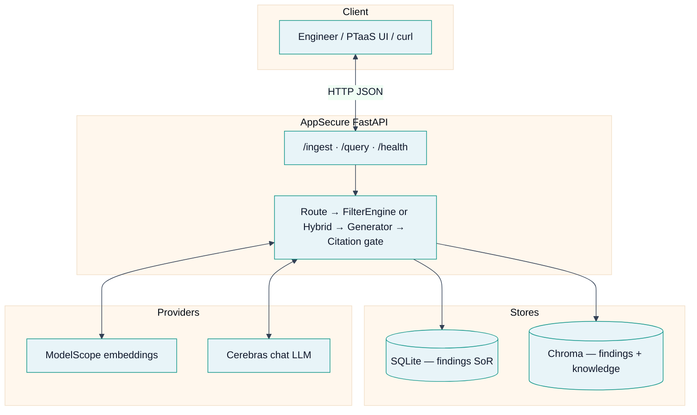
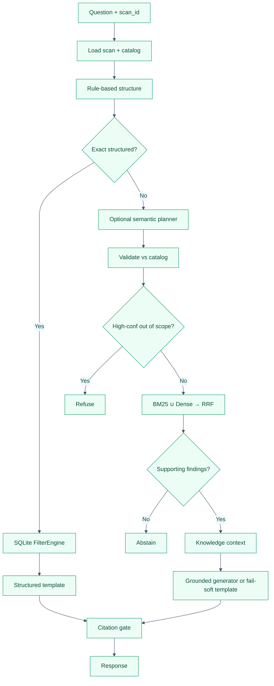
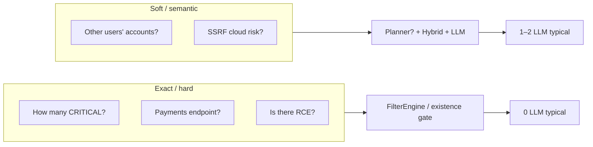
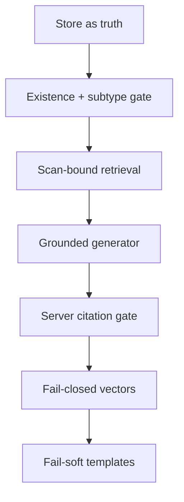

# Vulnerability Explainer RAG Agent (AppSecure)

[](https://www.python.org/)
[](https://fastapi.tiangolo.com/)
[](https://www.sqlite.org/)
[](https://www.trychroma.com/)
[](docs/VALIDATION.md)
[](docs/VALIDATION.md)
[](#license--assignment)

RAG-backed **FastAPI** service for natural-language Q&A over **application security scan results** — with **citations**, **hybrid retrieval**, and **hard anti-hallucination controls**.

Think of this as the backend for *“talk to your scan results”* in a PTaaS dashboard: list, explain, remediate, compare, and **abstain** when the scan does not support the claim.

> [!IMPORTANT]
> **Thesis** — Structured findings decide what exists. Hybrid retrieval resolves soft language. The LLM explains only verified findings.

| Layer | Choice |
|:------|:-------|
| **API** | FastAPI — `POST /ingest`, `POST /query`, `GET /health`, `GET /scans/{id}/findings` |
| **Findings store** | **SQLite** — system of record (complete inventory) |
| **Vector store** | **Chroma** — findings + knowledge; **fail-closed** metadata filters |
| **Embeddings** | `Qwen/Qwen3-Embedding-8B` (ModelScope, OpenAI-compatible) |
| **Chat LLM** | Cerebras `gemma-4-31b` (or any OpenAI-compatible base URL) |
| **Retrieval** | SQL `FilterEngine` + **BM25 ∪ dense → RRF** (cross-encoder off by default) |
| **Knowledge** | OWASP Top 10 2021 · CWEs · AppSec playbooks |
| **Docs** | [`ARCHITECTURE.md`](docs/ARCHITECTURE.md) · [`VALIDATION.md`](docs/VALIDATION.md) |

<p align="center">
  <a href="#quick-start"><strong>Quick start</strong></a> ·
  <a href="#docker"><strong>Docker</strong></a> ·
  <a href="#query-pipeline"><strong>Pipeline</strong></a> ·
  <a href="#anti-hallucination"><strong>Anti-hallucination</strong></a> ·
  <a href="docs/ARCHITECTURE.md"><strong>Architecture</strong></a> ·
  <a href="docs/VALIDATION.md"><strong>Validation</strong></a>
</p>

<details>
<summary><strong>Table of contents</strong></summary>

1. [Why this architecture](#why-this-architecture)
2. [System overview](#system-overview)
3. [Query pipeline](#query-pipeline)
4. [Anti-hallucination](#anti-hallucination)
5. [Knowledge base](#knowledge-base)
6. [Quick start](#quick-start)
7. [Docker](#docker)
8. [API reference](#api-reference)
9. [Configuration](#configuration)
10. [Project layout](#project-layout)
11. [Tests and measured evidence](#tests-and-measured-evidence)
12. [Sample questions](#sample-questions)
13. [Evaluation approach](#evaluation-approach)
14. [Known limitations](#known-limitations)
15. [Security notes](#security-notes)

</details>

---

## Why this architecture

Scanner findings are **authoritative structured records**. Pure top‑k vector RAG over JSON fails on full inventory, existence checks, and stable citations.

> [!TIP]
> **Rule of thumb:** use **SQL** when the question is exact; use **hybrid IR + LLM** when the language is soft; **never** let the model invent inventory.

| Approach | Failure mode on this problem |
|:---------|:-----------------------------|
| Embed JSON + chat | Misses full CRITICAL list; invents vulns and IDs |
| LLM free-form inventory | “15 CRITICAL” when there are 2 |
| SQL only | Weak on soft phrasing (“other users’ profiles”) |
| Unvalidated LLM citations | Hallucinated `FINDING-*` in the answer text |
| **This hybrid** | Exact ops from SQLite; soft questions via hybrid IR + grounded LLM |

### Design decisions (summary)

| Decision | Choice | Rationale |
|----------|--------|-----------|
| Findings storage | SQLite | Exact filters, re-ingest, zero infra, complete inventory |
| Vectors | Chroma + fail-closed `where` | Zero-ops demo; isolation; never bare-retry filters |
| Embeddings | Qwen3-Embedding-8B (ModelScope) | Strong general embedder; OpenAI-compatible API |
| LLM | Cerebras `gemma-4-31b` | Plan + narrate under latency budget |
| Free-text IR | BM25 + dense + RRF | Lexical exactness + semantic paraphrases |
| Orchestration | Filter-first hybrid | Inventory truth; LLM for narration only |
| Scope | Rules + planner `in_scope` | No required dedicated scope LLM |
| Tools agent | Off by default | Latency; not the main path |
| Fail-soft | Timeouts → store templates | Bounded latency; still grounded citations |

Full diagrams, sequences, and module map: **[`docs/ARCHITECTURE.md`](docs/ARCHITECTURE.md)**.

---

## System overview

<p align="center">
  
</p>




> [!NOTE]
> **Dual store** — SQLite answers “what is in this scan?” completely. Chroma supports soft language and knowledge context. **Knowledge never proves presence** — only finding rows do.

More diagrams (ingest sequence, hybrid IR, ER model, fail-soft): **[`docs/ARCHITECTURE.md`](docs/ARCHITECTURE.md)**.

---

## Query pipeline



### Hard vs soft questions



| Type | Example | Path | Typical LLM calls |
|------|---------|------|------------------:|
| Hard / exact | “How many CRITICAL?” “Top 3?” | FilterEngine / SQL | **0** |
| Existence absent | “Is there RCE?” “command injection?” | Existence + subtype gate → abstain | **0** |
| Soft explain | “SSRF cloud risk?” | Hybrid + generator | **1–2** |
| Soft ambiguous | Unusual phrasing | Planner + hybrid + generator | **2** (≤3 with repair) |

### LLM call budget (defaults)

| Path | Calls |
|------|------:|
| Count / list CRITICAL / A01 / top-N / inventory | **0** |
| Explain/fix with clear structure | **1** (generator) |
| Soft semantic | **2** (planner + generator) |
| Unsupported existence | **0–1** |
| Max normal (optional repair) | **≤3** |

Dedicated **scope LLM** and **tool agent** are **off by default**.

### Latency (target &lt; 10s)

| Path | Typical measured order |
|------|------------------------|
| Count / top‑N / strict filters | **ms – sub-second** |
| List / existence filters | **&lt; 1–2 s** |
| Soft explain / remediate | **often &lt; 2 s**; template if LLM fails soft |
| Live suite p50 / p95 | **~0.5 s / ~1.1 s** (one run — **not an SLA**) |

> [!WARNING]
> Latency is **provider-dependent** (embeddings + chat APIs). Numbers below are **one measured run**, not an SLA. Provider hang → timeout → **store-bound template**, not multi-minute stall.

---

## Anti-hallucination

Layered controls (prompts alone are **not** enough):



| Control | Behavior |
|---------|----------|
| Store as truth | Only rows in the selected scan can be “found” |
| Existence abstention | No support → `abstained=true`, empty refs |
| **Subtype existence** | “Command injection” needs direct support — SQLi/XSS via parent “injection” is **not** enough |
| Citation gate | `findings_referenced` ⊆ allowed IDs; unknown IDs stripped from text |
| Scan isolation | SQL + vector filters include `scan_id` |
| Fail-closed vectors | Filtered Chroma error → empty hits, never bare unfiltered retry |
| Fail-soft generation | LLM/embed failure → BM25/SQL + templates |
| Knowledge ≠ presence | Playbooks explain verified findings only |

**Specific vs broad existence**

```text
“Is there command injection?”  → strict subtype → abstain if no direct row
“Which injection findings?”    → family listing may return SQLi/XSS/SSRF
“Is there SQL injection?”      → FINDING-001 when present
```

---

## Knowledge base

| Layer | Location | Role |
|-------|----------|------|
| Sample scan | `data/sample_findings.json` | Demo fintech API (`api.wealthpilot.io`) |
| Held-out scan | `data/heldout_scan.json` | Logistics domain + alternate ID schemes |
| OWASP Top 10 2021 | `data/knowledge/owasp_top10_2021/` | Category context + citations |
| CWE definitions | `data/knowledge/cwe/` | Class context for findings in the sample |
| AppSec playbooks | `data/knowledge/appsec_guides/` | BOLA/IDOR, JWT `none`, SSRF, SQLi, auth hardening |

Playbooks improve *how* to explain/fix a **verified** finding. They never prove a finding **exists**.

---

## Quick start

### Prerequisites

| Need | Notes |
|:-----|:------|
| Python **3.11+** | 3.12–3.14 also validated |
| **ModelScope** API token | Embeddings |
| **Cerebras** (or OpenAI-compatible) API key | Chat / planner |

### 1. Configure

```bash
cp .env.example .env
# Set at least:
#   MODELSCOPE_API_KEY=...
#   LLM_API_KEY=...                 # e.g. Cerebras csk-...
#   LLM_BASE_URL=https://api.cerebras.ai/v1
#   LLM_MODEL=gemma-4-31b
```

> [!CAUTION]
> Never commit `.env`. Rotate any key that was pasted into chat or tickets.

### 2. Install & run

```bash
python -m venv .venv
source .venv/bin/activate          # Windows: .venv\Scripts\activate
pip install -r requirements.txt

uvicorn app.main:app --host 0.0.0.0 --port 8000
```

| URL | Purpose |
|:----|:--------|
| http://localhost:8000/docs | OpenAPI interactive docs |
| http://localhost:8000/health | Liveness + model/stack info |

### 3. Ingest + query

```bash
# Ingest sample scan (+ bundled knowledge on first loads)
curl -s http://localhost:8000/ingest \
  -H 'Content-Type: application/json' \
  -d "{\"scan\": $(cat data/sample_findings.json)}" | python -m json.tool

# Inventory question (often 0 LLM)
curl -s http://localhost:8000/query \
  -H 'Content-Type: application/json' \
  -d '{"question":"What are all the critical severity findings?"}' | python -m json.tool

# Held-out scan (different domain / IDs)
curl -s http://localhost:8000/ingest \
  -H 'Content-Type: application/json' \
  -d "{\"scan\": $(cat data/heldout_scan.json)}" | python -m json.tool

curl -s http://localhost:8000/query \
  -H 'Content-Type: application/json' \
  -d '{"question":"How many CRITICAL findings?","scan_id":"scan-heldout-shipyard-2026"}' \
  | python -m json.tool
```

### Demo scripts

| Script | Purpose |
|:-------|:--------|
| `./scripts/demo_queries.sh` | Assignment-style questions |
| `./scripts/hard_queries.sh` | Adversarial / multi-hop |
| `./scripts/live_validate.py` | Automated live suite (server + keys) |

---

## Docker

```bash
cp .env.example .env   # fill MODELSCOPE_API_KEY + LLM_API_KEY
docker compose up --build
curl -s http://localhost:8000/health | python -m json.tool
```

Then use the same ingest/query `curl` examples as above (host port **8000**).

| Compose piece | Behavior |
|---------------|----------|
| Image | Builds from `Dockerfile` (app + knowledge + sample + held-out JSON) |
| Volumes | Persist SQLite + Chroma under named volumes |
| `env_file` | Loads `.env` into the container |

Validated smoke: health, sample ingest, CRITICAL list, held-out count, command-injection abstain — see [`docs/VALIDATION.md`](docs/VALIDATION.md).

---

## API reference

### `POST /ingest`

Accepts a scan payload (and optional reference documents). Upserts SQLite findings, embeds finding narratives, indexes knowledge, rebuilds BM25.

**Request (conceptual):**

```json
{
  "scan": {
    "scan_id": "scan-20260324-001",
    "target": "api.wealthpilot.io",
    "scan_timestamp": "2026-03-24T14:30:00Z",
    "findings": [ { "id": "FINDING-001", "title": "...", "severity": "CRITICAL", "...": "..." } ]
  },
  "reference_documents": []
}
```

**Response:** `scan_id`, `findings_ingested`, `knowledge_chunks`, `status`, `latency_ms`.

### `POST /query`

```json
{
  "question": "How do I fix the SQL injection in transaction search?",
  "scan_id": "scan-20260324-001",
  "top_k_knowledge": 4
}
```

| Field | Meaning |
|-------|---------|
| `answer` | Grounded natural language (markdown-friendly plain text) |
| `citations` | Findings + optional knowledge references |
| `findings_referenced` | **Server-validated** finding IDs only |
| `query_intent` | Routed intent (`list`, `explain`, `remediation`, `existence`, …) |
| `grounded` | Always true for this API (answers constrained to pipeline) |
| `abstained` | `true` when the scan does not support the claim |
| `latency_ms` | Server-side timing |
| `scan_id` | Scan used for the answer |
| `answer_source` | `structured` \| `llm` \| `template` \| `abstain` |
| `model_used` | Chat model id when an LLM produced the answer |

`answer_source=template` means fail-soft after LLM failure — still store-bound, not free invention.

### `GET /health`

Liveness, finding/knowledge counts, embedding model, LLM chain, BM25 size, rerank mode, retrieval stack label.

### `GET /scans/{scan_id}/findings`

List structured findings for debug / explainability.

---

## Configuration

Copy from `.env.example`.

<details>
<summary><strong>Important defaults (click to expand)</strong></summary>

```bash
USE_SEMANTIC_PLANNER=true    # planner for ambiguous NL only
USE_DYNAMIC_SYNTHESIS=true   # LLM explain/remediate from retrieved rows
USE_LLM_SCOPE_GATE=false     # dedicated scope LLM off
USE_TOOL_AGENT=false         # multi-round tools off
RERANK_MODE=light
CROSS_ENCODER_ENABLED=false
LLM_TIMEOUT_S=20
LLM_MAX_RETRIES=0
EMBED_TIMEOUT_S=10
EMBED_MAX_RETRIES=0
```

Storage paths: `DATA_DIR`, `SQLITE_PATH`, `CHROMA_PATH`, `KNOWLEDGE_DIR`.

</details>

---

## Project layout

```text
app/
  main.py            # FastAPI app + lifespan (clients, BM25 warm)
  config.py          # Settings from env
  api/               # routes + Pydantic schemas
  clients/           # embeddings + LLM (timeouts, Fake* for tests)
  db/                # SQLAlchemy models (Scan, Finding)
  ingestion/         # ingest pipeline, knowledge loader
  retrieval/         # SQLite store, FilterEngine, hybrid, BM25, Chroma,
                     # taxonomy, existence_subtype
  rag/               # router, planner, generator, prompts, citations, scope
  services/          # QueryService + citation/pool/tool-agent helpers
data/
  sample_findings.json
  heldout_scan.json
  knowledge/         # owasp_top10_2021, cwe, appsec_guides
tests/               # offline suite (fake embed/LLM)
scripts/             # demo_queries, hard_queries, live_validate
docs/
  ARCHITECTURE.md    # full design (this is the deep dive)
  VALIDATION.md      # measured offline/live/Docker evidence
Dockerfile
docker-compose.yml
requirements.txt
.env.example
```

---

## Tests and measured evidence

### Offline (no network)

```bash
python -m venv .venv && source .venv/bin/activate
pip install -r requirements.txt
pytest -q
```

Also validated with a **clean** venv install.

Coverage includes: severity/OWASP/precision operators; citation gate; RCE/command-injection abstain; fail-closed vector isolation; held-out IDs; planner merge; fail-soft timeouts; golden cases; API smoke.

### Live (server + real keys)

```bash
uvicorn app.main:app --host 127.0.0.1 --port 8000
# ingest sample first
.venv/bin/python scripts/live_validate.py
```

### Measured evidence (one environment — **not an SLA**)

| Metric | Result |
|:-------|:-------|
| Offline suite | **144 passed** |
| Live correctness | **43 / 43** |
| README + Docker smoke | **OK** |
| Latency p50 | **~0.4–0.6 s** |
| Latency p95 | **~1.0–1.1 s** |

> [!NOTE]
> Some soft answers use **`answer_source=template`** when the chat model times out or returns invalid JSON. That is intentional **fail-soft** with store-bound citations — not free invention.

Full commands, paraphrase notes, Docker log: **[`docs/VALIDATION.md`](docs/VALIDATION.md)**.

---

## Sample questions

Assignment-style (sample scan):

1. What are all the critical severity findings?  
2. Explain the IDOR vulnerability on the accounts endpoint.  
3. How do I fix the SQL injection in transaction search?  
4. Which findings are related to OWASP A01 Broken Access Control?  
5. Is there a remote code execution vulnerability?  
6. What authentication issues were found?  
7. Give me a summary of all findings sorted by severity.  
8. What's the risk of the SSRF finding and how could an attacker exploit it?  
9. Are there any findings related to the payments endpoint?  
10. Compare the two IDOR findings — are they the same root cause?  

Useful demos of controls:

- “Are there any **command injection** findings?” → **abstain** (not SQLi/XSS)  
- Held-out: “How many CRITICAL findings?” with `scan_id=scan-heldout-shipyard-2026`  
- Held-out IDs: `SHIP-AUTH-01`, `web:xss:44`, `VULN_2026_91`

---

## Evaluation approach

Evaluation emphasizes **held-out evidence**, not sample memorization:

1. **Sample scan** — assignment-shaped demo (`FINDING-00N`).  
2. **Held-out scan** — logistics domain; IDs like `SHIP-AUTH-01`, `web:xss:44`, `VULN_2026_91`.  
3. **Isolation** — multi-scan queries must not leak IDs across `scan_id`.  
4. **Abstention** — unsupported existence and unknown endpoints refuse to invent.  
5. **No answer packs** — templates bind to store rows; no hardcoded held-out prose.  
6. **Subtype existence** — specific vulns require direct support, not parent-family OR matches.

---

## Known limitations

| Area | Limitation |
|:-----|:-----------|
| Soft NL | Not full NLU — unusual paraphrases can mis-route or abstain |
| Providers | Latency / quotas vary; inventory stays local/SQL |
| Taxonomy | Curated domain knowledge — not live MITRE/OWASP sync |
| Orchestrator | Modular but still centralized |
| Product scope | No multi-tenant auth / audit (take-home boundary) |
| Knowledge | Playbooks explain findings; they do **not** invent presence |

**Roadmap ideas:** broader multi-scan eval + CI latency budgets, stage-level observability, optional multi-tenant productization.

---

## Security notes

> [!CAUTION]
> Treat scanner **evidence** fields as **untrusted** in prompts. Never commit `.env` or paste live keys into tickets.

- Citation IDs are validated against retrieved/filtered findings for the **selected scan** only.  
- Chroma filtered queries **fail closed** — a broken `where` returns no hits, never unfiltered results.

---

## Further reading

| Document | Contents |
|----------|----------|
| **[`docs/ARCHITECTURE.md`](docs/ARCHITECTURE.md)** | Full architecture: context diagram, dual store, ingest/query sequences, hybrid IR, planner policy, citation gate, package map, failures, tradeoffs |
| **[`docs/VALIDATION.md`](docs/VALIDATION.md)** | Clean venv, live suite, Docker smoke, paraphrase notes, limitations |

---

## License / assignment

Take-home implementation for **AppSecure** (PTaaS). Datasets are fictional. OWASP/CWE materials include pointers for citation. **README + ARCHITECTURE.md** describe the shipped system; **VALIDATION.md** records how it was tested.
