# Architecture — Vulnerability Explainer RAG (AppSecure)

Reviewer-facing design document for natural-language Q&A over **application security scan findings**.

**Thesis**

> Structured findings decide what exists. Hybrid retrieval resolves soft language. The LLM explains only verified findings, with server-validated citations.

| Related docs | Role |
|--------------|------|
| [`../README.md`](../README.md) | Runbook, API summary, measured evidence |
| [`VALIDATION.md`](VALIDATION.md) | Offline / live / Docker validation log |

Diagrams use **Mermaid** (renders natively on GitHub) plus a hand-authored overview SVG ([`assets/architecture-overview.svg`](assets/architecture-overview.svg)) so arrows match the real pipeline (no generative image drift).


---

## Table of contents

1. [Problem framing](#1-problem-framing)
2. [System context](#2-system-context)
3. [Logical architecture](#3-logical-architecture)
4. [Data model](#4-data-model)
5. [Ingest pipeline](#5-ingest-pipeline)
6. [Query pipeline](#6-query-pipeline)
7. [Exact path vs soft path](#7-exact-path-vs-soft-path)
8. [Hybrid retrieval](#8-hybrid-retrieval)
9. [Planning, routing, and scope](#9-planning-routing-and-scope)
10. [Generation and citation gate](#10-generation-and-citation-gate)
11. [Anti-hallucination stack](#11-anti-hallucination-stack)
12. [Package map](#12-package-map)
13. [Runtime configuration](#13-runtime-configuration)
14. [Deployment](#14-deployment)
15. [Failure modes and fail-soft](#15-failure-modes-and-fail-soft)
16. [Tradeoffs and limitations](#16-tradeoffs-and-limitations)
17. [Security notes](#17-security-notes)

---

## 1. Problem framing

### 1.1 Product goal

PTaaS / AppSec scanners emit dense structured findings (severity, CWE, endpoint, evidence, remediation). Users ask natural language questions. The system must:

- list and filter the **complete** inventory for a scan;
- explain and remediate **only** findings that exist;
- **abstain** when the scan does not support the claim;
- attach **citations** that the server can verify.

### 1.2 Required query families

| Family | Example | Correctness risk if wrong |
|--------|---------|---------------------------|
| Inventory / count | “How many CRITICAL?” | Invented counts |
| Filter list | “A01 findings”, “payments endpoint” | Missing or extra rows |
| Explain / risk | “What’s the risk of the SSRF finding?” | Fabricated impact |
| Remediate | “How do I fix SQLi in transaction search?” | Wrong fix / wrong finding |
| Existence | “Is there RCE?” / “command injection?” | False positive presence |
| Compare / cluster | “Compare the two IDORs” | Cross-finding hallucination |

### 1.3 Why not pure vector RAG

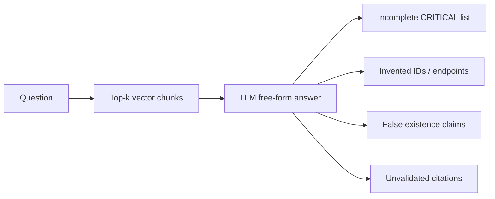

| Approach | Typical failure |
|----------|-----------------|
| Embed full JSON + chat | Incomplete lists; invented endpoints/IDs |
| LLM free-form inventory | “15 CRITICAL” when there are 2 |
| SQL only | Soft phrasing (“other users’ profiles”) weak |
| Unvalidated LLM citations | Hallucinated finding IDs in text |

**Design response:** dual store (SQLite + Chroma), exact-vs-soft path split, citation gate, subtype-aware existence, fail-closed vector filters.

---

## 2. System context

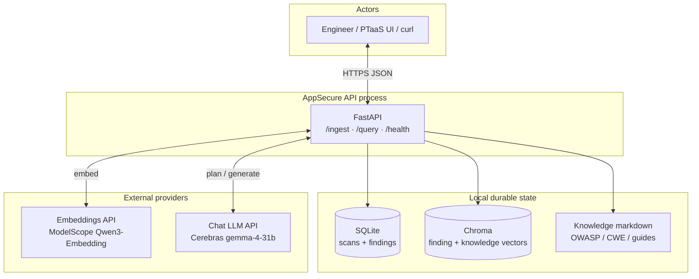

**Trust boundary:** scanner evidence fields are treated as untrusted text inside prompts. API keys live only in environment / `.env` (not in git).

---

## 3. Logical architecture

### 3.1 Overview figure


**How to read it:** exact questions take **Route/Plan → FilterEngine → Generator → Citation Gate**. Soft questions take **Route/Plan → Hybrid (BM25∪Dense→RRF) → Generator → Citation Gate**. Hybrid still **resolves rows from SQLite** by finding id. Optional planner and grounded generate call the **chat LLM**; embeddings are used for **ingest** and **dense query** only. The LLM does **not** talk to Chroma directly.


### 3.2 Internal components

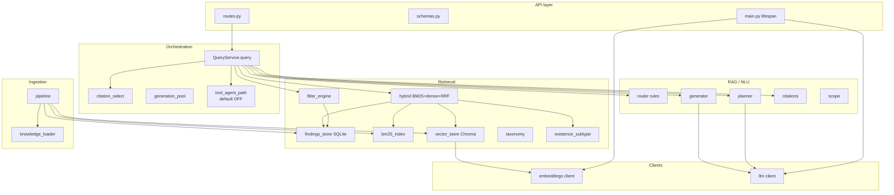

### 3.3 Dual-store split

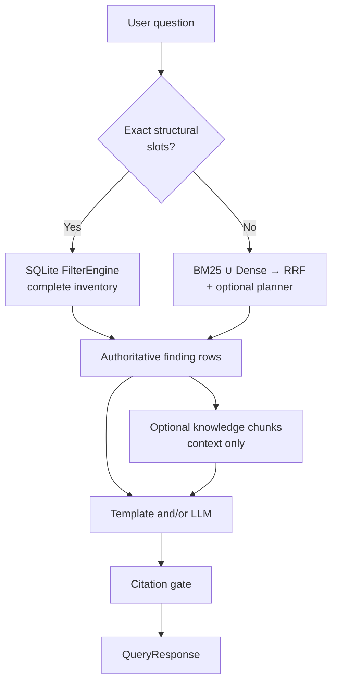

| Store | Technology | Guarantees | Does not guarantee |
|-------|------------|------------|--------------------|
| Findings SoR | SQLite | Complete scan membership; exact filters; re-ingest | Soft paraphrase understanding |
| Vectors | Chroma | Approximate semantic neighbors; knowledge context | Full inventory completeness |

---

## 4. Data model

### 4.1 Relational (SQLite)

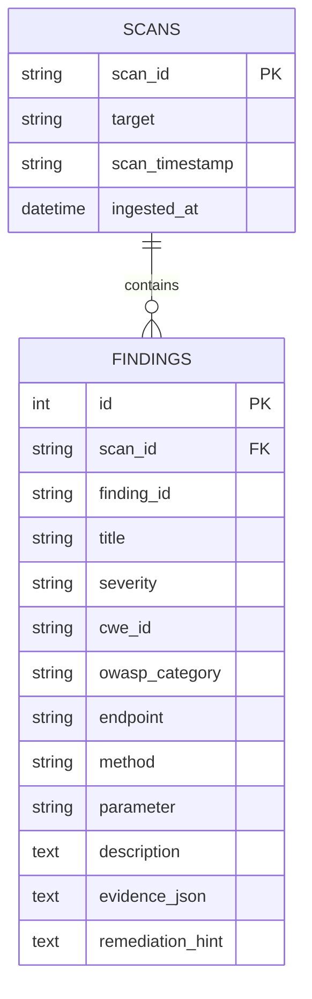

Finding IDs are **opaque catalog strings** (`FINDING-001`, `SHIP-AUTH-01`, `web:xss:44`, …) — unique per `(scan_id, finding_id)`.

### 4.2 Vector documents (Chroma)

| Kind | Typical metadata | Purpose |
|------|------------------|---------|
| Finding narrative | `doc_type=finding`, `scan_id`, `source_id` | Soft retrieval of scan rows |
| Knowledge | `doc_type` ∈ cwe / owasp / guide, `source_id` | Remediation context after findings selected |

**Invariant:** knowledge chunks never alone justify “finding X exists.”

### 4.3 In-memory IR

- **BM25** over finding text (rebuild on ingest / process warm-start)
- Optional **cross-encoder** shortlist rerank (default **off**)

---

## 5. Ingest pipeline

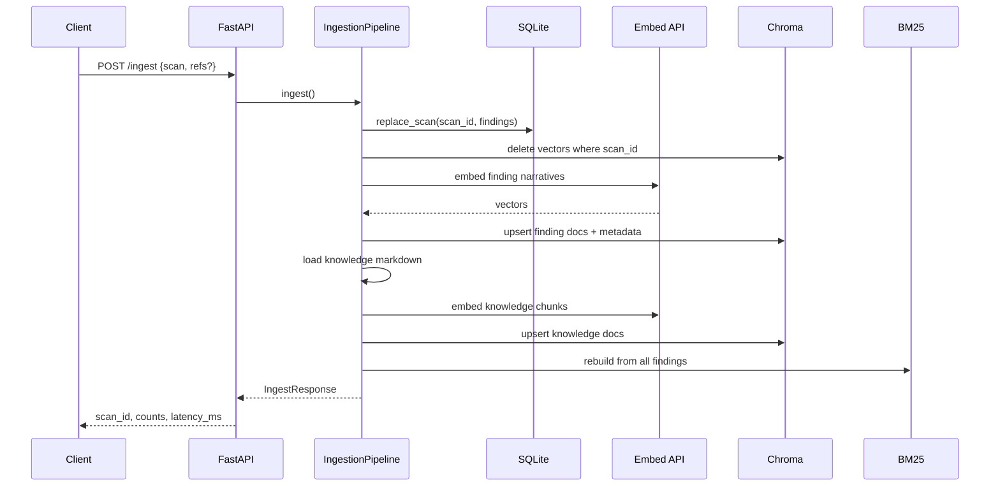

**Properties:** per-`scan_id` replace is idempotent; multi-scan coexistence; knowledge under `data/knowledge/`.

---

## 6. Query pipeline

### 6.1 Control flow

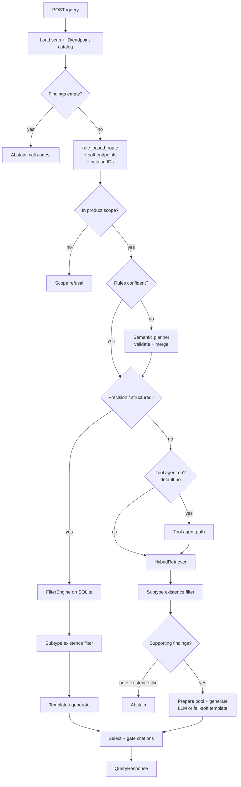

### 6.2 Orchestrator stages (`QueryService`)

1. Load scan + catalogs  
2. `_build_route_and_plan`  
3. `_execute_structured_query` (or soft)  
4. Unknown-path abstain when applicable  
5. `try_tool_agent` (default off)  
6. `_execute_semantic_query`  
7. `_generate_response` + citation selection/gate  

---

## 7. Exact path vs soft path

### 7.1 Exact / precision path

Triggered by high-confidence operators: count, top-N, severity lists, strict endpoints, finding IDs, include/exclude phrases/topics for lists, path-param shape.

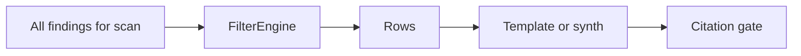

Often **0 LLM** for inventory templates.

### 7.2 Soft path

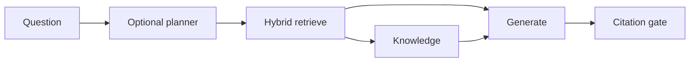

### 7.3 LLM call budget (defaults)

| Path | Chat LLM calls |
|------|---------------:|
| Count / CRITICAL list / A01 / top-N | **0** |
| Explain/fix with clear structure | **1** |
| Soft semantic | **2** (planner + generator) |
| Unsupported existence | **0–1** |
| Max normal (+ optional repair) | **≤3** |

Scope LLM and tool agent: **off by default**.

---

## 8. Hybrid retrieval

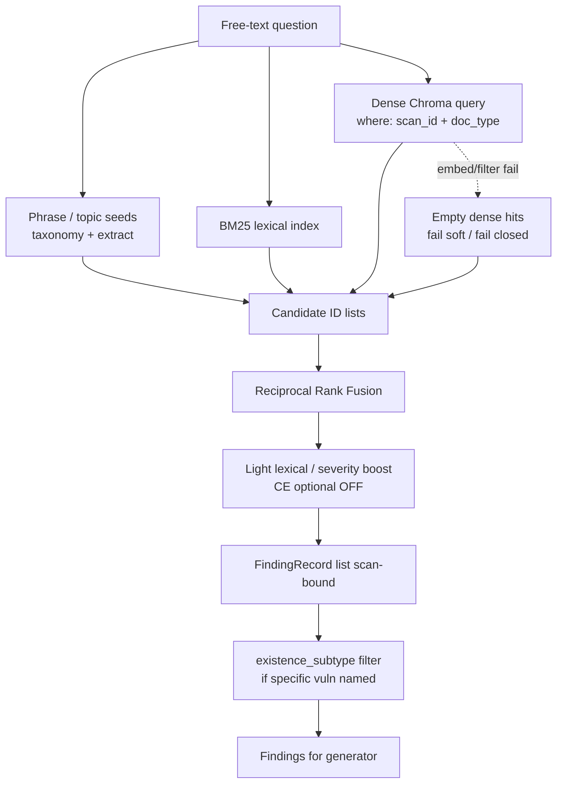

| Channel | Strength |
|---------|----------|
| BM25 | Paths, acronyms, exact tokens |
| Dense | Paraphrases (“other users’ accounts”) |
| RRF | Simple fusion without learned weights |
| Fail-closed `where` | Never drop `scan_id` on error |

---

## 9. Planning, routing, and scope

### 9.1 Type roles

| Type | Role |
|------|------|
| `RouteResult` | Explicit user syntax / rules output |
| `QueryPlan` | Optional semantic interpretation (`in_scope`, slots) |
| `FilterSpec` | Input to SQLite FilterEngine |

### 9.2 Planner policy

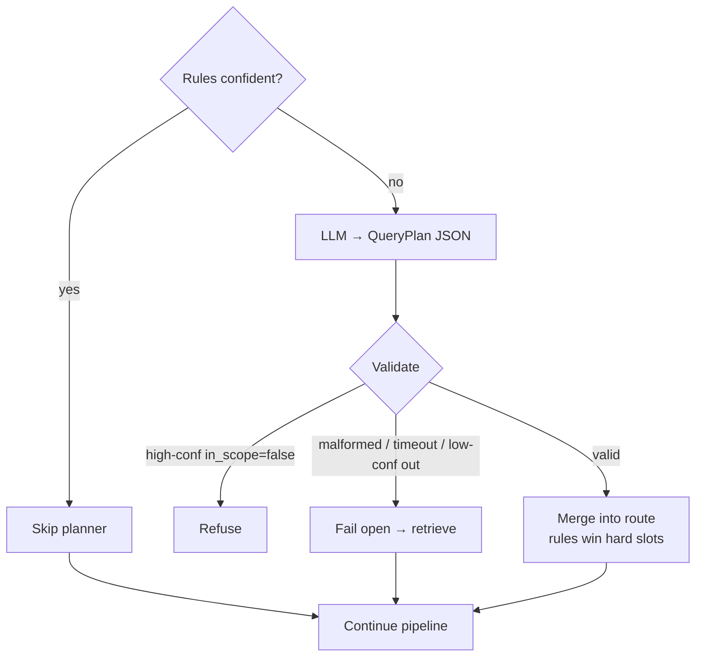

Planner must not invent finding IDs absent from the catalog / question.

### 9.3 Scope order

1. Structural scan slots → in scope  
2. Obvious junk → refuse  
3. Optional scope LLM (default **false**)  
4. Else fail open; unsupported claims abstain later  

---

## 10. Generation and citation gate

### 10.1 Generator modes

| Mode | `answer_source` | Use |
|------|-----------------|-----|
| Structured templates | `structured` | Counts, lists, existence yes, clusters |
| LLM JSON | `llm` | Explain / remediate / compare |
| Fail-soft template | `template` | LLM timeout / invalid JSON |
| Abstain | `abstain` | No support / OOS / empty store |

### 10.2 Citation pipeline

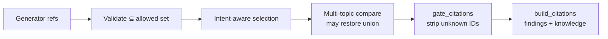

---

## 11. Anti-hallucination stack

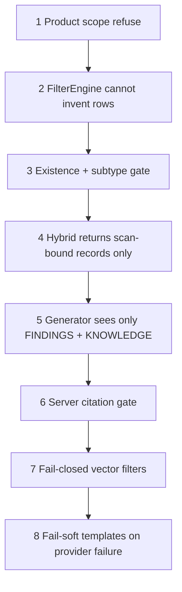

### Specific vs broad existence

| Question style | Behavior |
|----------------|----------|
| “Is there **command injection**?” | Direct support only (wording / CWE-78); SQLi ≠ command injection |
| “Which **injection** findings?” | Family listing may include SQLi/XSS/SSRF |
| “Is there **SQL injection**?” | Direct SQLi / CWE-89 |

Module: `app/retrieval/existence_subtype.py`.

---

## 12. Package map

```text
app/
├── main.py / config.py
├── api/           routes, schemas
├── clients/       embeddings, llm (+ timeouts)
├── db/            Scan, Finding models
├── ingestion/     pipeline, knowledge_loader
├── retrieval/     findings_store, filter_engine, hybrid, bm25,
│                  vector_store, taxonomy, existence_subtype
├── rag/           router, planner, generator, citations, scope, tools*
└── services/      query_service, citation_select, generation_pool,
                   tool_agent_path, pipeline_common
```

`*` tool agent optional / off by default.

---

## 13. Runtime configuration

| Variable | Default | Meaning |
|----------|---------|---------|
| `USE_SEMANTIC_PLANNER` | true | Soft NL → QueryPlan |
| `USE_DYNAMIC_SYNTHESIS` | true | LLM narrative |
| `USE_LLM_SCOPE_GATE` | **false** | Dedicated scope LLM |
| `USE_TOOL_AGENT` | **false** | Multi-round tools |
| `RERANK_MODE` | **light** | RRF + light boosts |
| `CROSS_ENCODER_ENABLED` | **false** | Optional CE |
| `LLM_TIMEOUT_S` | 20 | Chat timeout |
| `EMBED_TIMEOUT_S` | 10 | Embed timeout |

See `.env.example`.

---

## 14. Deployment

### Local

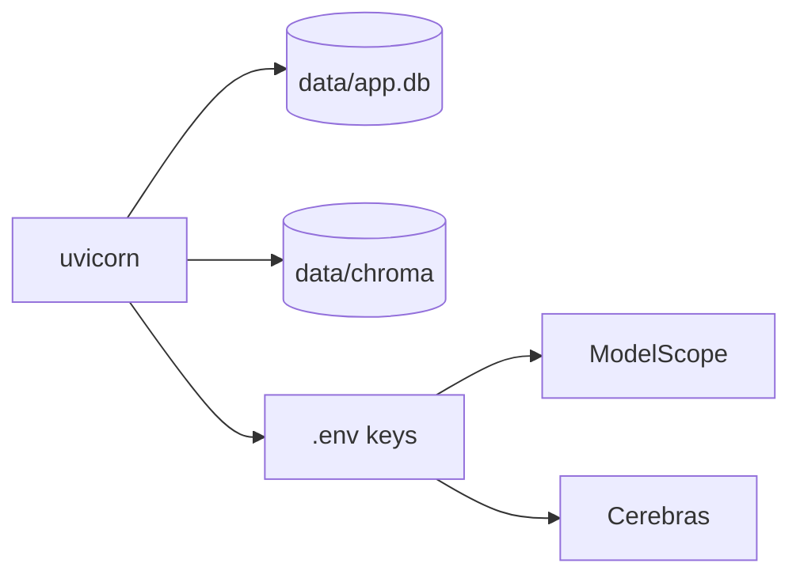

### Docker Compose

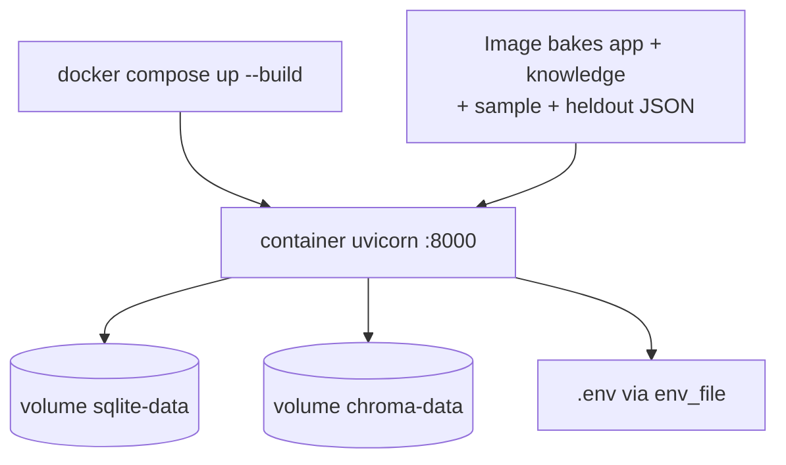

---

## 15. Failure modes and fail-soft

| Failure | Behavior |
|---------|----------|
| No findings ingested | Fixed message: call `/ingest` |
| Out of product scope | Fixed refusal |
| Existence unsupported | `abstained=true`, empty refs |
| Specific subtype absent | Abstain even if parent family has rows |
| Chroma filtered query error | Empty hits (**fail closed**) |
| Embed timeout/error | Dense empty; BM25/SQL continue |
| LLM timeout / bad JSON | Row-bound **template** + valid IDs |
| Planner error | Fail open to retrieval |

---

## 16. Tradeoffs and limitations

| Decision | Benefit | Cost |
|----------|---------|------|
| SQLite first | Exact inventory | Soft NL needs hybrid |
| Single Chroma collection | Simple ingest | Isolation via metadata + fail-closed only |
| Whole-doc knowledge vectors | Stable IDs on topic-sized files | Large uploads need chunking |
| Curated taxonomy | Predictable AppSec classes | Incomplete open-domain NL |
| Rules + optional planner | Low LLM cost on hard ops | Soft mis-routes possible |
| Planner fail-open | Avoid false refuse | Occasional weak soft path |
| No CE by default | Less latency / deps | Slightly lower soft precision |
| No dedicated scope LLM | Fewer calls | Soft boundary = rules + plan + abstain |
| Strict citations | No free-form ID invent | Tighter answers |
| Provider timeouts | Bounded latency | More `template` under load |
| Catalog endpoint match | No inventing paths | Needs token overlap with scan |

**Limitations:** soft paraphrases can miss; taxonomy is curated; orchestrator still centralized; latency is provider-dependent; no multi-tenant auth; knowledge is whole-doc for a compact corpus.

**Authoritative expanded table:** [README — Design tradeoffs](../README.md#design-tradeoffs).

**Next (product):** knowledge chunking for large refs, multi-scan eval + CI budgets, stage metrics, tenant isolation, cached/local embeds.

---

## 17. Security notes

- Treat `evidence` as untrusted.  
- Never commit `.env` or keys.  
- Citations validated against selected scan only.  
- Vector filters fail closed on error.

---

*Architecture document is authoritative for system design. Runbooks and measured numbers: README + VALIDATION.md.*
